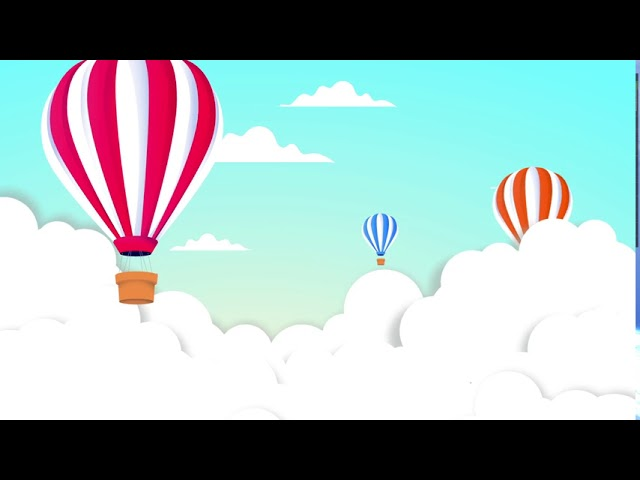
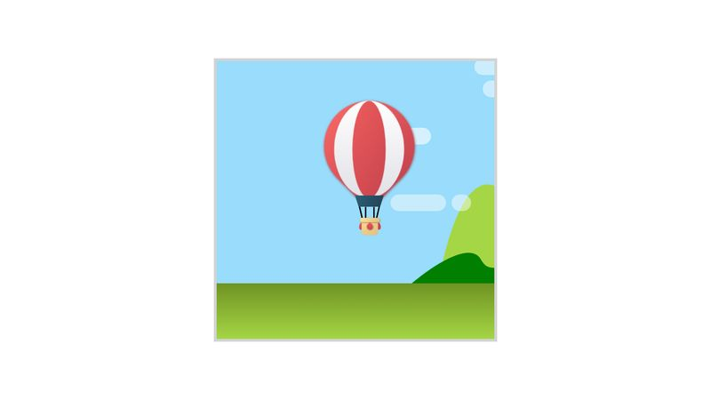
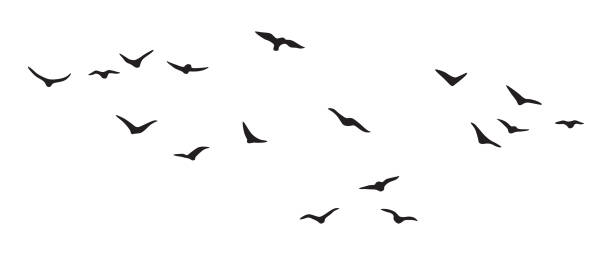
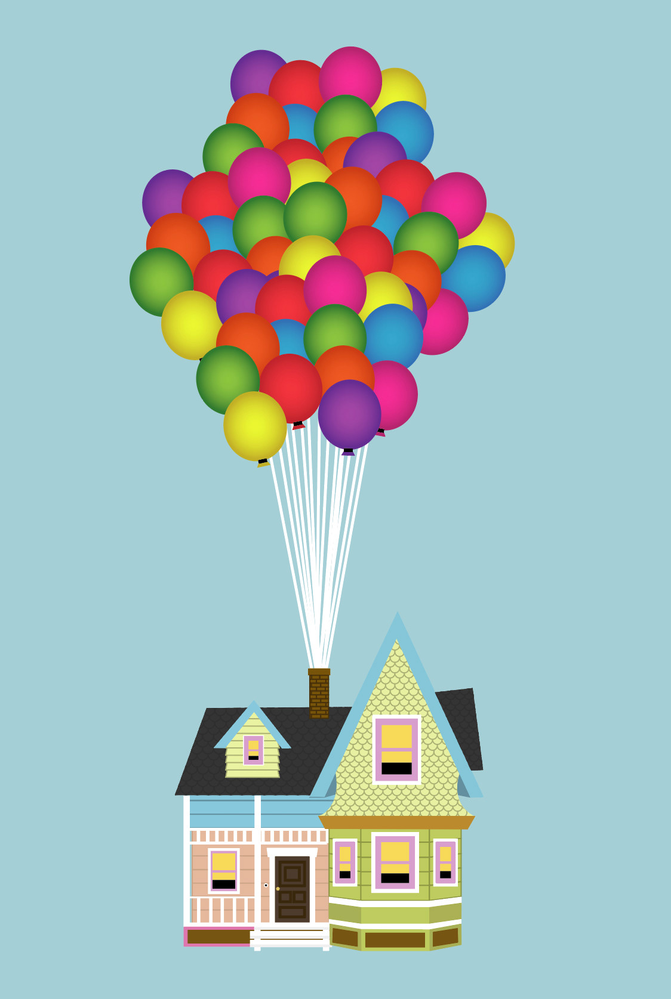

# CSSToTheRescue
CSS to the rescue school opdracht

Week 1:

keuze: Control Panel 
Ideeën: 
Space ship control panel 
Sneeuwbol, maar dan in 4 seizoenen. 
Kawaii cute animal laten animeren.
Tamagotchi

een poppetje die een houten knuppel vasthoudt. Je kan de knuppel langer maken, dikker maken en je kan het poppetje laten swingen, springen en dansen.
De control panel wordt een joystick dat aan en uit gezet kan worden.
Functies: 
1 - knuppel langer, dikker: Met een sliders kun je de knuppel langer en dikker maken.
2 - springen: met een druk op een knop kan je het poppetje laten springen
3 - slaan: met een druk op de knop kan je de poppetje laten slaan. Dan verschijnt er een ander poppetje dat het poppetje kan slaan.
4 - dansen: je kan het poppetje laten dansen.

keuze:

Een luchtballon dat kan opstijgen.
Functies:
1. - Opstijgen & dalen: Met een hendel kan je de temperatuurr regelen. De temperatuur krijg je dan te zien. 
Bij een hoge temperatuur stijgt de ballon sneller omhoog en een lage temperatuur daalt de ballon.
2. Hoogte meter: Een display waarbij je de hoogte ziet van je ballon
3. Wolken: Wanneer je op een bepaalde hoogte zit zie je geanimeerde wolken. Met een slider kan je de wolken sneller of langzamer laten gaan.
4. Dag- en nachtcyclus: je kan met een druk van een knop de sfeer nacht en dag maken.
5. Brandstof: er is een brandstof meter, wanneer dit op is dan daalt de luchtballon snel.
6. Brandstof powerups: Op een bepaalde hoogte worden er brandstof powerups gevonden. Die worden ook geanimeerd van links naar rechts. Bij een klik erop kan je de brandstof oppakken.
7. weereffecten: Je kan het laten regenen, sneeuwen of het is een zonnige dag.
8. vogels: vogels vliegen heen en weer, je ballon gaat een stukje omlaag wanneer een vogel tegen je ballon aankomt.
9. Verschillende ballonnen: Je kan de stijl van de ballon aanpassen zoals kleuren en grote.
10. Op een bepaalde hoogte heb je een easteregg, wanneer je langer dan een bepaalde tijd op die hoogte blijft, zie je het huis van up voorbij komen.
11. De hoogste hoogte die je hebt bereikt wordt bewaard en displayed.

Degene die het hoogst komt heeft gewonnen.

https://www.pyxofy.com/css-art-hot-air-balloon/
https://codepen.io/shooft/pen/RNwpNav?editors=0110
https://www.youtube.com/watch?v=e6jnl3iAezM

Week 2:
In week 2 heb ik gradients onderzocht en ermee geëxperimenteerd. Het is mij gelukt om de luchtballon met gradients te maken en vervolgens heb ik het mandje en de zakjes gemaakt in aparte li's

https://cssgradient.io/blog/gradient-patterns/
https://codepen.io/CoryMaklin/pen/wXRRye - rising sun
https://codepen.io/billyysea/pen/nLroLY?editors=1100 - sky gradients
https://codepen.io/agathaco/pen/rpZoYd?editors=0100 - trees
https://codepen.io/jonslater204/pen/LYWQbMa - space invaders
https://codepen.io/nelledejones/pen/gOOPWrK?editors=0100 - cool animations
https://www.w3schools.com/howto/howto_css_hide_scrollbars.asp