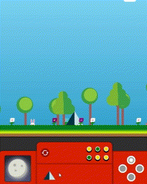

# CSSToTheRescue
CSS to the rescue school opdracht

# Week 1:

keuze: Control Panel 
Ideeën: 
Space ship control panel 
Sneeuwbol, maar dan in 4 seizoenen. 
Kawaii cute animal laten animeren.
Tamagotchi

een poppetje die een houten knuppel vasthoudt. Je kan de knuppel langer maken, dikker maken en je kan het poppetje laten swingen, springen en dansen.
De control panel wordt een joystick dat aan en uit gezet kan worden.
Functies: 
1. knuppel langer, dikker: Met een sliders kun je de knuppel langer en dikker maken.
2. springen: met een druk op een knop kan je het poppetje laten springen
3. slaan: met een druk op de knop kan je de poppetje laten slaan. Dan verschijnt er een ander poppetje dat het poppetje kan slaan.
4. dansen: je kan het poppetje laten dansen.

keuze:

Een luchtballon dat kan opstijgen.
Functies:
1.  Opstijgen & dalen: Met een hendel kan je de temperatuurr regelen. De temperatuur krijg je dan te zien. 
2. Bij een hoge temperatuur stijgt de ballon sneller omhoog en een lage temperatuur daalt de ballon.
3. Hoogte meter: Een display waarbij je de hoogte ziet van je ballon
4. Wolken: Wanneer je op een bepaalde hoogte zit zie je geanimeerde wolken. Met een slider kan je de wolken sneller of langzamer laten gaan.
5. Dag- en nachtcyclus: je kan met een druk van een knop de sfeer nacht en dag maken.
6. Brandstof: er is een brandstof meter, wanneer dit op is dan daalt de luchtballon snel.
7. Brandstof powerups: Op een bepaalde hoogte worden er brandstof powerups gevonden. Die worden ook geanimeerd van links naar rechts. Bij een klik erop kan je de brandstof oppakken.
8. weereffecten: Je kan het laten regenen, sneeuwen of het is een zonnige dag.
9. vogels: vogels vliegen heen en weer, je ballon gaat een stukje omlaag wanneer een vogel tegen je ballon aankomt.
10. Verschillende ballonnen: Je kan de stijl van de ballon aanpassen zoals kleuren en grote.
11. Op een bepaalde hoogte heb je een easteregg, wanneer je langer dan een bepaalde tijd op die hoogte blijft, zie je het huis van up voorbij komen.
12. De hoogste hoogte die je hebt bereikt wordt bewaard en displayed.

Degene die het hoogst komt heeft gewonnen.


https://www.pyxofy.com/css-art-hot-air-balloon/
https://codepen.io/shooft/pen/RNwpNav?editors=0110
https://www.youtube.com/watch?v=e6jnl3iAezM

# Week 2: 

In week 2 heb ik gradients onderzocht en ermee geëxperimenteerd. Het is mij gelukt om de luchtballon met gradients te maken en vervolgens heb ik het mandje en de zakjes gemaakt in aparte li's voor een betere nesting. voor het maken van de balloon heb ik inspiratie gehaald uit de volgende website: https://www.pyxofy.com/css-art-hot-air-balloon/


# Week 3:
Na het maken van de ballon heb ik mij verdiept in het maken van de controls. Hiervoor heb ik de volgende bron gebruikt: https://codepen.io/jonslater204/pen/LYWQbMa - space invaders. Hier heb ik de controls van bekeken en onderzocht.


Wanneer je klikt op een checkbox gaat gaat de li waarin de labels instaan met een display flex en een gap van de button size. Vervolgens veranderd de ballon van plek met transform translate.


Ook wilde ik een daynight circle maken met een mooie animatie. Sterretjes die komen in de nacht en die nog blinken. Wanneer de zon opkomt gaan de sterretjes natuurlijk weg. De gradients heb ik van: https://codepen.io/billyysea/pen/nLroLY?editors=1100 - sky gradients en de animatie inspiratie heb ik van: https://codepen.io/CoryMaklin/pen/wXRRye - rising sun

   


De canvas leek me nog heel erg leeg dus heb ik wat gras, bloemetjes, bomen en konijnen toegevoegd. Hier heb ik de inspiratie voor de bomen en konijn gehaald uit: https://codepen.io/agathaco/pen/rpZoYd?editors=0100 - trees. Ook heb ik voor de bomen en bloemetjes een container gebruikt waardoor er minder bomen zijn bij een kleinere wijdte van de ul waarin de bomen en bloemetjes zitten.


De bunny heeft een animation dat het om de 2 seconden omhoog en omlaag gaat.


Dit is de css waardoor de bomen een verschillende height krijgen.
```css
  li:nth-of-type(2n + 4) {
    height: clamp(2em, calc(var(--index-stam) * 1vw), var(--tree-1-height));
  }
    > li:nth-of-type(1) {
    --index-stam: 1;
  }
  > li:nth-of-type(2) {
    --index-stam: 2;
  }
  /* etc */
```

De achtergrond nog steeds beetje kalig dus heb ik een berg in gedachte met een animatie. Wanneer er een berg ontstaat, ontstaat dit natuurlijk uit een "aardbeving"/aardverschuiving. de shake animation heb ik van de volgende website: https://www.w3schools.com/howto/tryit.asp?filename=tryhow_css_image_shake


Het maken van een driehoek wordt gedaan met borders:

```css
  --width-mountain: clamp(14em, 30vw, 25em);
  --height-mountain: clamp(30em, 69vw, 39em);
  --bottom-mountain: -35em;

  border-width: 0 var(--width-mountain) var(--height-mountain)
  var(--width-mountain);

```

Vervolgens heb ik buttons gemaakt 3 voor de size


en 3 voor de kleuren.


De buttons worden aangeroepen met de :has selector:

```css
body:has(#kleur-ballon-2:checked) main > ul:first-of-type {
  --balloon-color: var(--balloon-color-2);
}

body:has(#kleur-ballon-3:checked) main > ul:first-of-type {
  --balloon-color: var(--balloon-color-3);
}

body:has(#scale-balloon-sm:checked) main > ul:first-of-type {
  --size: clamp(2rem, 10vw, 3rem);
  z-index: 0;
}

body:has(#scale-balloon-l:checked) main > ul:first-of-type {
  --size: clamp(11rem, 20vw, 15rem);
}
```

# Week#4

In week 4 heb ik nagedacht over het design van de control panel. 


De panel heb ik verdeeld in een grid van 4 bij 2. ik heb een ol gebruikt en daarin li'tjes met grid-area's

HTML
```css
    <ol>
      <li></li>
      <li></li>
      <li></li>
      <li></li>
    </ol>
```

CSS
```css
    display: grid;
    grid-template-columns: 1fr 1fr 1fr 1fr;
    grid-template-rows: 1fr 1fr;
    grid-template-areas:
      "grid1 grid2 grid2 grid4"
      "grid1 grid3 grid3 grid4";
```

Vervolgens heb ik de zon en maan in een display gezet: 


De moon krijgt een gelatine jiggle animation https://codepen.io/nelledejones/pen/gOOPWrK?editors=0100 - cool animations:

```css
@keyframes --gelatine {
  from,
  to {
    transform: scale(1, 1);
  }
  25% {
    transform: scale(0.9, 1.1);
  }
  50% {
    transform: scale(1.1, 0.9);
  }
  75% {
    transform: scale(0.95, 1.05);
  }
}
```

Daarna heb ik de buttons toegevoegd in de panel en er een design aan gegeven zodat ze meer op een button lijken:
Scaling: ik heb de grootte aangepast. Ook is er een kleine detail dat wanneer je de kleinste formaat bent, je dan achter de andere ballonnen en boompjes bent.


De andere buttons veranderen de kleur van de ballon en nu ook de kleur van de controlpanel.


De berg heeft nu een eigen icoontje om de animatie te activeren en een rewind button waardoor de html pagina zich opnieuw laad.



Vervolgens heb ik gespeeld met de controls. Nu kan je zien hoe hoog je gaat en wanneer je op de grond valt krijg je een bounce effectje en wanneer je vliegt met de ballon, dan zie je dat het niet teleporteert maar echt vliegt.


Hiervoor heb ik de volgende twee websites gebruikt: https://developer.chrome.com/docs/css-ui/css-linear-easing-function?hl=nl, https://matthewlein.com/tools/ceaser.

flying animation
```css
transition: all 150ms cubic-bezier(0.595, 0.975, 0.28, 0.005); /* custom */
```

bounce animation
```css
  transition: all 500ms
    linear(
      /* Start to 1st bounce */ 0,
      0.004,
      0.016,
      0.035,
      0.063 9.1%,
      0.141,
      0.25,
      0.391,
      0.563,
      0.765,
      1,
      /* 1st to 2nd bounce */ 0.891,
      0.813 45.5%,
      0.785,
      0.766,
      0.754,
      0.75,
      0.754,
      0.766,
      0.785,
      0.813 63.6%,
      0.891,
      1 72.7%,
      /* 2nd to 3rd bounce */ 0.973,
      0.953,
      0.941,
      0.938,
      0.941,
      0.953,
      0.973,
      1,
      /* 3rd bounce to end */ 0.988,
      0.984,
      0.988,
      1
    ); /* custom */
```
The end - om het volledig te maken heb ik een coole animatie voor de tekst gemaakt en de achtergrond zwart gemaakt met inset. Om het ook levendig te maken heb ik er ook extra ballonnen bij toegevoegd om de wereld wat levendiger te maken. Verder zie je ook dat de bomen van hoogte veranderen bij het starten van de wereld.

 

Om te beginnen wil ik de tekst bespreken. Inspiratie heb ik vanuit https://prismic.io/blog/css-text-animations voor de wavy text animation. Ze gebruiken een span voor elk letter in een h1 en dan geven ze een animation delay van .2s op elk span. Dit heb ik uitgebreid tot een formule dat er zo uitziet:

```css
    animation: --wave 2s ease-in-out infinite, --rainbowcolor 1.5s linear infinite;
    animation-delay: calc(.4s * (var(--index-h1) - 1));

```

Voor elke span heb ik een index gegeven en de animation delay toegepast op elke span. Dit had dus ook effect op alle animations die je erin toepast. dus heb ik ook een kleuren animatie toegepast.

voor de wavy text
```css
    @keyframes --wave {
    0%, 100% {
        transform: translateY(0);
    }
    50% {
        transform: translateY(-20px);
    }
    }
```

voor de color text
```css

    @keyframes --rainbowcolor {
    0%{
        color: red;
    }
    25%{
        color: blue;
    }

    50%{
        color: green;
    }

    75%{
        color: yellow;
    }
    }
```

en dan krijg je dit: 


De balloon heeft ook een wave animation en ik heb het verplaatst naar het midden met transform translate.


Verder zit er ook een start knop in en begint er een andere animatie. de tekst gaat weg, je ziet de achtergrond opkomen, de bomen krijgen een hoogte en de luchtballon gaat naar de linkerkant.

 

De zwarte achtergrond is gemaakt met inset zoals dit:

```css
  box-shadow: inset 0 0 0 400px black;

  body:has(#welcome:checked) main{
    box-shadow: inset 0 0 0 0 black;
  }
```

de div waarin de h1 zit scaled weg:
```css
  body:has(#welcome:checked) main > div{
    transform: scale(0);
  }
```

Het balon geef ik zijn originele positie terug:
```css
  body:has(#welcome:checked) main > ul:first-of-type{
    bottom: calc(var(--size) / 2);
    left: 0;
    animation: none;
  }
```

En de bomen gaan van 0 height naar hun originele custom heights:

```css
  body:has(#welcome:checked) main ul:nth-of-type(3) {
    --tree-1-height: 12em;
    --tree-2-height:9em;
  }
```

Alle labels zijn niet clickable zolang de start nog niet gechecked is:

```css
  label:not(:has(#welcome)){
    pointer-events: none;
  }

    body:has(#welcome:checked) label:not(:has(#welcome)){
    pointer-events: auto;
  }
```

En als laatst zijn er nog 3 extra luchtballonnetjes om de wereld meer levendiger te maken. en een extra bunny met een andere animatie


```css
@keyframes --rabbit-lr{
  0%, 100%{
    transform: translateX(0px);
  }
  40% , 60%{
    transform: translateX(50px);
  }
  29%, 41%{
    transform: translateY(0px);
  }
  30%, 40%{
    transform: translateX(50px);
    transform: translateY(-25px);
  }
  20%, 70%{
    transform: translateX(80px);
  }

}
```


# Conclusie
Aan het begin van mijn avontuur naar Loonsworld had ik wilde ideeën, maar ik wist niet zeker of ik er ooit zou komen. De eerste twee weken waren nogal rustig en chill, en ik had nog geen besef van hoe kort de tijd eigenlijk zou zijn. Ik heb rustig aan gedaan met de ballon en veel geëxperimenteerd totdat het uiteindelijk lukte.

Vanaf dat punt werd het makkelijker, maar ik had nog maar een week over. Met goede dutjes en nachten doorhalen heb ik uiteindelijk het eindresultaat bereikt waar ik naar verlangde. Toch voelt het alsof ik er nog meer uit had kunnen halen — en dat is waarschijnlijk ook zo.

Toch ben ik wel heel trots op mezelf.

## Wat heb ik in mijn code gebruikt?
1.  Geen classes, wel id's voor labels en inputs
2.  display: Flex/ Grid
3.  position: relative/absolute - left/top/right/bottom
4.  ::before/::after - content=''
5.  :has, :checked, :not, :hover
6.  Custom Properties
7.  Css nesting
8.  calc()
9.  Box-shadow/ inset
10. gradients - linear/ radial
11. transform: translate/ scale/ rotate
12. @keyframes
13. --index
14. Mask
15. @container

## Watvoor tips heb ik?

1. Je kunt meerdere gradients gebruiken in de background of background-image.
2. Het is mogelijk om twee verschillende gradients of kleuren te combineren in de background en background-image.
3. De :has-selector is erg krachtig en leuk om mee te werken. Tot nu toe heb ik vooral de combinatie :has met input:checked gebruikt om een actie te laten plaatsvinden bij een klik.
4. Gebruik geen mask als je een box-shadow wilt gebruiken voor een glow-effect. Het mask knipt namelijk ook de box-shadow weg.
5. Je kunt meerdere animaties toepassen op hetzelfde element.
6. Zoek online naar inspiratie voor gradients, bijvoorbeeld "sky gradient colors" of "dirt gradient colors".
7. Gebruik de inspectietool om je gradients aan te passen. Dit maakt het vinden van de juiste vorm veel makkelijker.
8. Er zijn veel codepens waar je ideeën en inspiratie uit kunt halen.
9. Online zijn er talloze leuke CSS-animaties te vinden.
10. Coderen is net als begrijpend lezen: vertaal je code naar het Nederlands om het beter te begrijpen!

## Wat heb ik bereikt?
1. Betere begrip in code
2. Vertrouwen dat ik kan coderen
3. Kennis over een deel van css
4. Coderen is ook leuk


## Bronnenlijst
https://www.pyxofy.com/css-art-hot-air-balloon/ - hot air balloon made with css
https://codepen.io/CoryMaklin/pen/wXRRye - rising sun
https://codepen.io/billyysea/pen/nLroLY?editors=1100 - sky gradients
https://codepen.io/agathaco/pen/rpZoYd?editors=0100 - trees
https://codepen.io/jonslater204/pen/LYWQbMa - space invaders
https://codepen.io/nelledejones/pen/gOOPWrK?editors=0100 - cool animations
https://www.w3schools.com/howto/howto_css_hide_scrollbars.asp - hide scrollbar
https://developer.chrome.com/docs/css-ui/css-linear-easing-function?hl=nl - bounce animation
https://matthewlein.com/tools/ceaser - vlieg animation
https://www.w3schools.com/howto/tryit.asp?filename=tryhow_css_image_shake - shake animation
https://prismic.io/blog/css-text-animations - Text animations